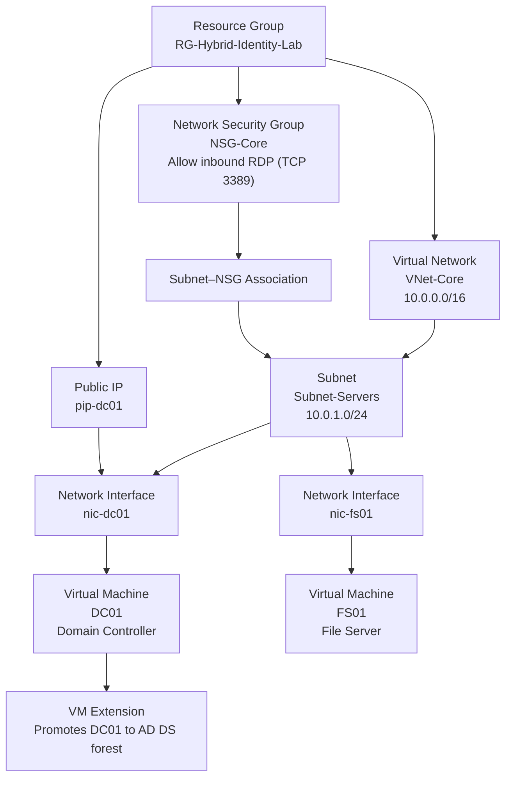

# Enterprise Hybrid Identity & Access Management Lab - Layer 1

This repository contains the Infrastructure as Code (IaC) and PowerShell automation scripts for Layer 1 of a comprehensive Hybrid Identity and Cloud Security architecture. 

The primary objective of this project is to engineer a scalable, on-premises Active Directory and File Services foundation from scratch, intentionally avoiding GUI shortcuts. By separating the Domain Controller from the File Server and fully automating the infrastructure and user lifecycle, this lab accurately mimics a real-world enterprise environment prepared for hybrid cloud integration.

## 🎯 Project Objectives
* **Infrastructure as Code (IaC):** Provision a secure Azure Virtual Network, subnets, Network Security Groups (NSGs), and virtual machines entirely via Terraform.
* **Identity Management:** Programmatically generate mock employee data, establish an Active Directory Organizational Unit (OU) hierarchy, and provision users and Global Security Groups via PowerShell.
* **Access Control (Zero Trust Foundation):** Architect strict NTFS permission boundaries and SMB file shares on a dedicated file server, adhering to the Principle of Least Privilege.
* **Network Routing:** Manage custom DNS routing within Azure Virtual Networks to facilitate internal domain joining across isolated virtual machines.

---

## 🏗️ Architecture Diagram

---

## 🚀 Engineering Phases & Walkthrough

### Phase 1: Infrastructure Deployment (Terraform)
The foundation of the environment is built on Azure using declarative Terraform configuration.
* **Network Isolation:** Deployed a core Virtual Network (`VNet-Core`) and a dedicated subnet (`Subnet-Servers`). Network Security Groups (NSGs) were applied at the subnet level to restrict inbound access strictly to RDP (TCP 3389).
* **Compute Provisioning:** Deployed two separate Windows Server 2022 virtual machines (`DC01` and `FS01`). `DC01` is exposed via a Public IP for administrative access, while `FS01` remains strictly internal.
* **Automated AD Promotion:** Utilized the `azurerm_virtual_machine_extension` resource to execute a custom script during deployment, automatically installing the AD DS role and promoting `DC01` to a new forest (`blakecloudsolutions.local`) without manual intervention.

### Phase 2: Active Directory Automation & Lifecycle Management
Rather than manually creating users, I engineered a robust PowerShell script (`Create-50Users.ps1`) to handle bulk enterprise onboarding.
* **Dynamic Data Generation:** The script dynamically generates a mock HR CSV dataset containing 50 employees across three departments (HR, IT, Sales).
* **Organizational Structure:** Programmatically built the Active Directory hierarchy, generating Organizational Units (`OU=HR`, `OU=IT`, `OU=Sales`) and their corresponding Global Security Groups (`SG-HR`, `SG-IT`, `SG-Sales`).
* **Account Provisioning:** Iterated through the dataset to automatically create user accounts with standardized naming conventions (e.g., `jdoe@blakecloudsolutions.local`), secure default passwords, and immediate mapping to their respective departmental security groups. Output is logged locally for audit trails.

### Phase 3: File Server Hardening & NTFS Access Control
To simulate secure corporate data management, `FS01` was configured as a dedicated file server.
* **Domain Join:** Overcame initial DNS resolution constraints by manually configuring the DNS client server address on `FS01` to point to the private IP of `DC01`, allowing a successful Active Directory domain join.
* **SMB & NTFS Separation:** Executed a configuration script (`Configure-NTFS-Shares.ps1`) to create departmental file directories. SMB share permissions were set to `Everyone: Full Control` to shift the security boundary entirely to the file system level.
* **Strict NTFS Inheritance:** Disabled default inheritance on the departmental folders. Injected strict NTFS permission rules tied directly to the AD Global Security Groups. Validated that standard users cannot traverse into unauthorized departmental folders (e.g., an IT user cannot access the HR folder).

---

## 🛠️ Technology Stack
* **Cloud Provider:** Microsoft Azure
* **Infrastructure as Code:** HashiCorp Terraform
* **Configuration Management:** PowerShell 5.1 / Active Directory Module
* **Operating Systems:** Windows Server 2022 Datacenter
* **Core Services:** Active Directory Domain Services (AD DS), DNS, SMB/NTFS

---

## 🧠 Lessons Learned & Challenges Overcome
* **Custom DNS Routing for Domain Joins:** Out of the box, Azure VMs use Azure-provided DNS. When attempting to join `FS01` to the newly created `blakecloudsolutions.local` domain, it failed because Azure DNS had no record of it. The solution required updating the DNS settings on `FS01`'s network interface to point directly to `DC01`'s private IP (`10.0.1.4`), bridging the communication gap.
* **Terraform State Management & GitHub Limits:** When attempting to push the IaC code to GitHub, the `.terraform` directory contained provider files exceeding GitHub's 100MB limit. Resolved this by properly configuring a `.gitignore` file and clearing Git's cache, ensuring only the source code is tracked.

---

## 🔜 Next Steps
**Layer 2: Cloud Infrastructure Governance (Azure RBAC)**
With the on-premises identity and file storage foundation securely established, the next phase of this architecture will focus on extending these identities into the cloud using Microsoft Entra ID (formerly Azure AD) and implementing Role-Based Access Control (RBAC).