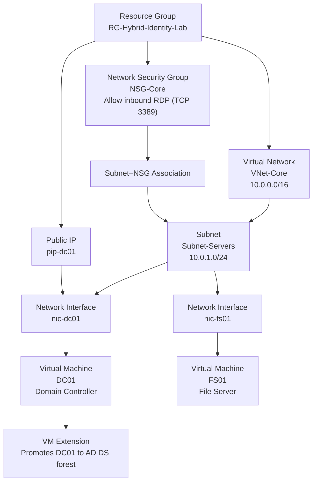

# Enterprise Active Directory & NTFS Security Lab

The backbone of file access control in enterprise IT systems administration relies on Windows File Servers backed by Active Directory groups and strict NTFS permissions[cite: 18]. This repository documents the complete engineering workflow to build a scalable, on-premises Identity and Access Management (IAM) foundation from scratch using Infrastructure as Code (IaC) and advanced PowerShell automation.

## The Business Problem & Objectives
Organizations face the constant challenge of controlling who can access specific departmental data[cite: 18]. Finance data must be isolated from Sales, while IT requires administrative oversight to maintain the systems. 

By bypassing the GUI and fully automating the infrastructure deployment and user lifecycle, this project eliminates configuration drift and establishes an explicit, secure permission boundary prepared for hybrid cloud integration.

| Skill | Why it matters in a real environment |
| :--- | :--- |
| **Deploy Active Directory with Terraform** | Infrastructure as Code ensures the environment is reproducible, version-controlled, and auditable rather than manually configured. |
| **Create OUs and Security Groups** | Security Groups allow administrators to manage access for hundreds of employees by modifying a single group membership instead of editing individual file permissions. |
| **Configure NTFS Permissions** | NTFS is the primary enforcement layer on Windows file systems; understanding inheritance and group access is mandatory for Cloud Security and system administration. |
| **Secure SMB Shares** | SMB handles file sharing across the network; separating share-level permissions from strict NTFS-level boundaries is a critical enterprise standard. |

## Architecture & Components

| Component | What it does | Why it's needed|
| :--- | :--- | :--- |
| **VNet & Subnet** | Private network routing for the servers. | VMs on the same VNet communicate via private IPs; the `/24` subnet provides ample addresses for expansion. |
| **NSG-Core** | Firewall rules at the network interface layer[cite: 20]. | Restricts inbound port 3389 to prevent the virtual machines from being exposed to the public internet. |
| **DC01** | Domain Controller for `blakecloudsolutions.local`. | Centralizes Active Directory, identity management, and DNS routing for the domain. |
| **FS01** | Member File Server. | Hosts the SMB network shares and enforces the NTFS permission matrix per security group. |

## Engineering Workflow

### 1. Infrastructure Deployment (Terraform)
* Deployed the core Azure Virtual Network, Subnet, and Network Security Group to establish a secure perimeter.
* Provisioned the Domain Controller (`DC01`) and the File Server (`FS01`).
* Executed an Azure Custom Script Extension to automatically install the AD DS role and promote `DC01` to a forest, completely avoiding manual GUI setups.
* Engineered custom DNS routing on `FS01` to point to `DC01`, allowing for a successful automated domain join.

### 2. Automated Active Directory Provisioning
* Authored a PowerShell script to dynamically generate a mock HR CSV dataset containing 50 randomized user identities.
* Programmatically built the Active Directory hierarchy, establishing Organizational Units (`OU=HR`, `OU=IT`, `OU=Sales`) and mapping them to Global Security Groups (`SG-HR`, `SG-IT`, `SG-Sales`).
* Ingested the generated CSV to automatically provision all 50 user accounts, map them to their respective departments, and assign them to the correct security groups, outputting the results to a local audit log.

### 3. File Server Security & NTFS Hardening
* Created structured departmental file directories on `FS01` via PowerShell.
* Configured SMB file shares with standard `Everyone` Full Access to properly separate network share availability from file-level security[cite: 29, 30].
* Disabled default inheritance (`SetAccessRuleProtection`) and injected strict NTFS Access Control Lists (ACLs) tied directly to the Active Directory security groups (`BCLOUDSOLUTIONS\SG-HR`, etc.).

## Validation Matrix
This matrix validates that the implemented permission model successfully aligns with the business requirements.

| Test User Group | Target Share | Expected Result[cite: 35] | Reason |
| :--- | :--- | :--- | :--- |
| `SG-HR` Member | `\\FS01\HR-Data` | Read & Write | Inherits `Modify` access directly from the `SG-HR` NTFS rule. |
| `SG-HR` Member | `\\FS01\Sales-Data` | Access Denied | Not a member of `SG-Sales`; no Access Control Entry exists for HR on this share. |
| `SG-IT` Member | `\\FS01\HR-Data` | Read & Write | IT administrators require `FullControl` across all departmental shares for system maintenance |

## Lessons Learned & Troubleshooting
* **Domain Controller Promotion & NetBIOS Conflicts:** Encountered promotion failures due to a domain naming conflict. Resolved by explicitly defining the NetBIOS name (`BCLOUDSOLUTIONS`) in the automated deployment script and implementing a post-promotion reboot to stabilize Active Directory Web Services.
* **Custom DNS Routing & Domain Join Timing:** Because the File Server (`FS01`) was intentionally separated from the Domain Controller (`DC01`), `FS01` could not natively resolve `blakecloudsolutions.local`. Engineered a PowerShell loop to set `FS01`'s primary DNS to `DC01`'s static IP (`10.0.1.4`) and continuously retry resolution before executing the domain join[cite: 31].
* **PowerShell Syntax & RDP Clipboard Corruption:** Initially faced persistent script parser errors when transferring code via RDP clipboard. Mitigated by using VS Code as a clean text intermediary and executing automation via native Azure Custom Script Extensions (`az vm run-command`) to completely bypass the need for RDP[cite: 18].
* **Infrastructure as Code State Management:** Attempting to commit the raw Terraform workspace to GitHub initially triggered a file size block due to the 200MB+ Azure Provider executable. Resolved by implementing a strict `.gitignore` to keep `.terraform/` and `*.tfstate` files out of version control, protecting both repository size and sensitive state secrets.
* **Azure CLI Authentication Tokens:** Deployment scripts failed when the underlying Azure CLI session expired. Resolved by validating the correct subscription context via `az login` before executing `terraform apply` to ensure Key Vault and resource group provisioning had the necessary authorization.