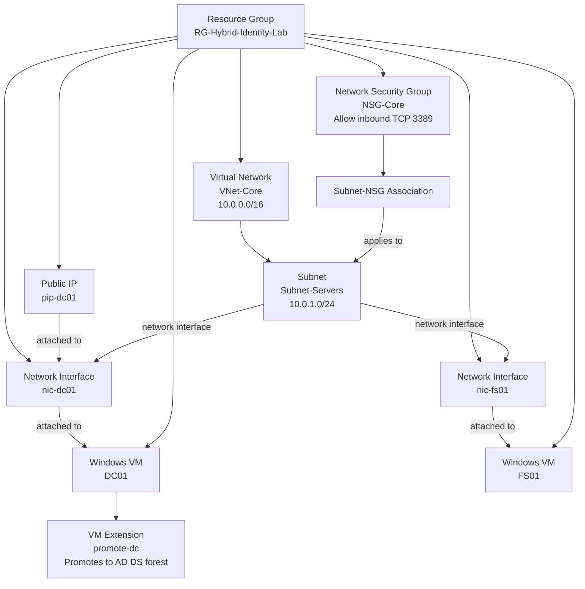

# Hybrid Identity Lab Infrastructure

The Terraform configuration provisions a core virtual network and subnet, a
domain controller (DC01), and a file server (FS01). Both servers connect to
the same subnet, where the NSG association applies the RDP rule. Only DC01 is
configured with a public IP.

